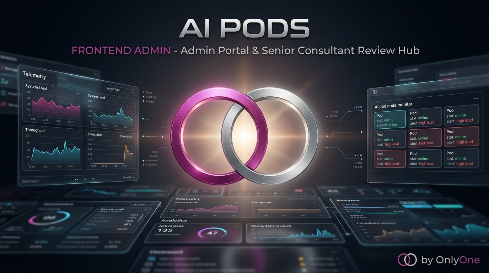

<p align="center">
  
</p>

# 🛡️ AI Pods Enterprise (SaaS) - Admin Portal & Review Hub (`aipods-frontend-admin`)

Este repositorio contiene la aplicación web en **React 18 / Vite** del Portal de Administración interna, la consola de gestión FinOps por tenant y el **Senior Consultant Review Hub** para auditar y aprobar respuestas complejas de AI Pods.

## 🛠️ Tecnologías del Admin Portal

* **React 18 / Vite:** Interfaz ligera, rápida y modular.
* **Seguridad Enterprise:** Autenticación mTLS y OIDC/OAuth2 con soporte para Microsoft Entra ID.
* **Senior Review Hub:** Panel de revisión de respuestas asistidas antes de ejecución con `dry_run`.

---

## 💻 Guía de Desarrollo Local

```bash
# 1. Instalar dependencias
npm install

# 2. Levantar el servidor de desarrollo en puerto 3001
npm run dev

# 3. Compilar la aplicación para producción
npm run build
```

---

## 🔒 Licencia

Todos los derechos reservados © 2026 Martin Llanos. Licencia Propietaria.
